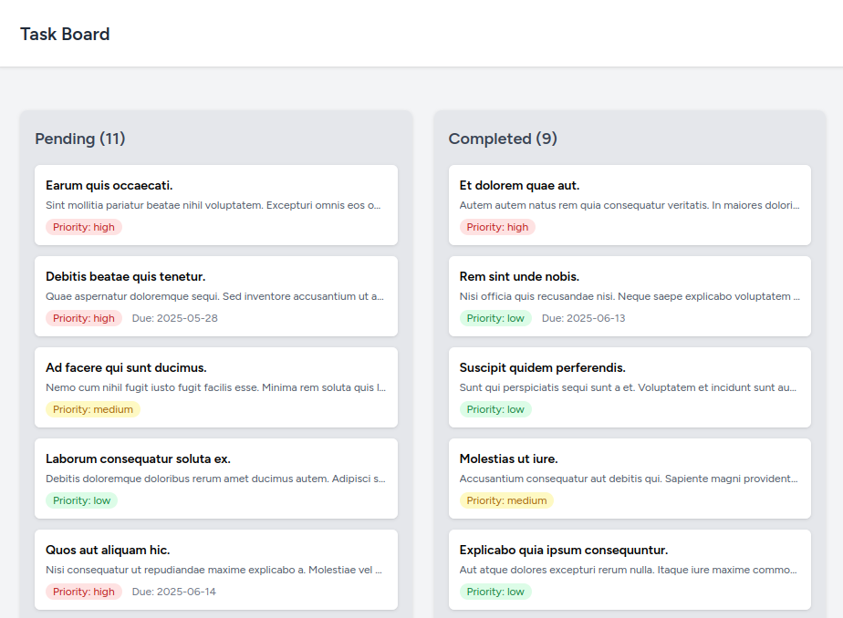
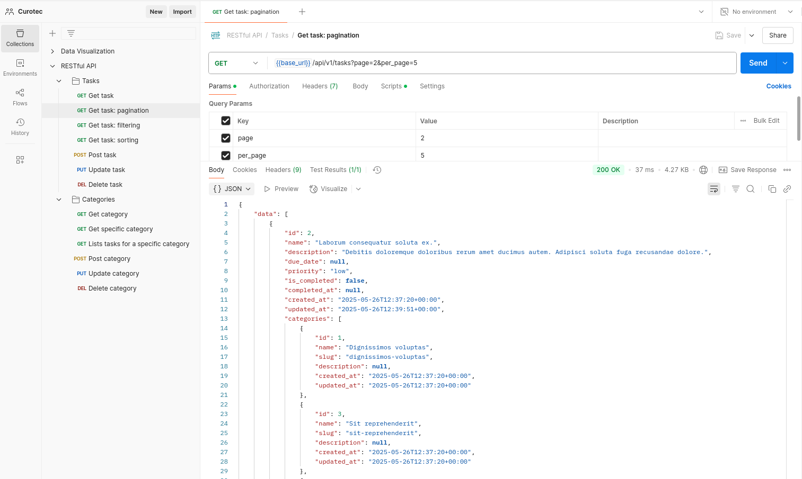

# Task Management System (Laravel & Vue.js)

This project is a full-stack task management application built with Laravel 10 on the backend and Vue.js 3 (with Inertia.js) on the frontend. It features API-driven task and category management, a real-time drag-and-drop task board, and is designed to showcase best practices in modern web development.

## Table of Contents

1.  [Overview](#overview)
2.  [Features](#features)
3.  [Tech Stack](#tech-stack)
4.  [Prerequisites](#prerequisites)
5.  [Getting Started (Using Laravel Sail)](#getting-started-using-laravel-sail)
    - [Initial Setup](#initial-setup)
    - [Environment Configuration](#environment-configuration)
    - [Running the Application with Sail](#running-the-application-with-sail)
    - [Database Migrations and Seeding](#database-migrations-and-seeding)
    - [Running Laravel Reverb (for Real-time Features)](#running-laravel-reverb-for-real-time-features)
6.  [Accessing the Application](#accessing-the-application)
7.  [Running Tests](#running-tests)
8.  [Known Issues & Areas for Improvement](#known-issues--areas-for-improvement)
9.  [Application Screenshots](#application-screenshots)
10. [Contributing](#contributing)
11. [License](#license)

## Overview

This application allows users to manage tasks, categorize them, and visualize their workflow on a Kanban-style board. It demonstrates:

- RESTful API design with Laravel.
- Efficient data management with Eloquent ORM.
- Reactive frontend development with Vue.js 3 and the Composition API.
- State management with Pinia.
- Seamless page navigation with Inertia.js.
- Real-time updates using Laravel Reverb (WebSocket server).
- Development environment containerization with Laravel Sail.

## Features

- **Task Management:** Create, Read, Update, and Delete tasks.
- **Category Management:** Create, Read, Update, and Delete categories for organizing tasks.
- **Many-to-Many Relationship:** Tasks can belong to multiple categories.
- **API Endpoints:**
  - Filtering, sorting, and pagination for tasks and categories.
  - Nested resource for listing tasks within a specific category.
- **Task Board:**
  - Visual lanes for "Pending" and "Completed" tasks.
  - Drag-and-drop functionality to change task status.
  - Optimistic UI updates with debounced API calls.
- **Real-time Updates:** Changes to tasks (creation, updates, deletion) are reflected in real-time on the task board for all connected clients using Laravel Reverb and Echo.
- **User Authentication:** Basic user registration and login (leveraging Laravel Jetstream).

## Tech Stack

- **Backend:** Laravel 10
- **Frontend:** Vue.js 3 (with Composition API & `<script setup>`)
- **Bridging:** Inertia.js 1.0
- **Database:** PostgreSQL 15
- **State Management:** Pinia 2
- **Testing:** Pest 2
- **Development Environment:** Laravel Sail (Docker)
- **Real-time Communication:** Laravel Reverb (WebSocket Server), Laravel Echo
- **CSS Styling:** Tailwind CSS (via Jetstream)

## Prerequisites

Before you begin, ensure you have the following installed on your system:

- **Docker Desktop:** Laravel Sail uses Docker to create a consistent development environment.
- **WSL 2 (for Windows users):** Required for Docker Desktop to run Linux containers efficiently on Windows.
- **Composer:** For managing PHP dependencies.
- **Node.js and npm (or yarn):** For managing frontend dependencies and assets.
- **Git:** For version control.

## Getting Started (Using Laravel Sail)

Laravel Sail provides a simple command-line interface for interacting with your Laravel project's Docker development environment.

### Initial Setup

1.  **Clone the repository:**

    ```bash
    git clone <your-repository-url> task-manager
    cd task-manager
    ```

2.  **Install PHP Dependencies:**
    If you have PHP and Composer installed locally:

    ```bash
    composer install
    ```

    Alternatively, use Sail's Docker container to run Composer:

    ```bash
    docker run --rm \
        -u "$(id -u):$(id -g)" \
        -v "$(pwd):/var/www/html" \
        -w /var/www/html \
        laravelsail/php82-composer:latest \
        composer install --ignore-platform-reqs
    ```

    _(Adjust `laravelsail/php82-composer:latest` if using a different PHP version for Sail)_

3.  **Copy Environment File:**
    ```bash
    cp .env.example .env
    ```

### Environment Configuration (`.env` file)

Open the `.env` file and configure the following critical variables for Sail and the application:

```dotenv
# Application URL & Port (for Sail)
APP_NAME="Task Manager"
APP_ENV=local
APP_KEY= # Will be generated in the next step
APP_DEBUG=true
APP_URL=http://localhost
APP_PORT=80 # Default port Sail's app container will try to use on host. Change if port 80 is in use.

# Database Connection (Sail will manage PostgreSQL container)
DB_CONNECTION=pgsql
DB_HOST=pgsql # Service name from docker-compose.yml
DB_PORT=5432
DB_DATABASE=task_manager_db
DB_USERNAME=sail
DB_PASSWORD=password

# Broadcast Driver for Real-time
BROADCAST_CONNECTION=reverb

# Reverb Configuration (for both server and client via VITE)
REVERB_APP_ID=your_reverb_app_id # e.g., 12345 (generate one)
REVERB_APP_KEY=your_reverb_app_key # e.g., use Str::random(20) in tinker
REVERB_APP_SECRET=your_reverb_secret # e.g., use Str::random(32) in tinker
REVERB_HOST="localhost" # Hostname client connects to
REVERB_PORT=8080        # Port client connects to AND port exposed from Sail container
REVERB_SCHEME=http      # Scheme client uses

# Reverb Server Process Configuration (how Reverb server itself listens)
REVERB_SERVER_HOST=0.0.0.0 # Reverb listens on all interfaces inside the container
REVERB_SERVER_PORT=8080    # Reverb listens on this port inside the container

# Vite variables for client-side Echo
VITE_APP_NAME="${APP_NAME}"
VITE_REVERB_APP_KEY="${REVERB_APP_KEY}"
VITE_REVERB_HOST="${REVERB_HOST}"
VITE_REVERB_PORT="${REVERB_PORT}"
VITE_REVERB_SCHEME="${REVERB_SCHEME}"

# Queue Connection (optional, but good for broadcasting)
QUEUE_CONNECTION=database # Or redis if you have it configured
```

**Important Notes for `.env`:**

- If port `80` on your host machine is already in use by another application, change `APP_PORT` to a different value (e.g., `APP_PORT=8000`) and update `APP_URL` accordingly (e.g., `APP_URL=http://localhost:8000`).
- The `DB_HOST` should be the service name of your PostgreSQL container as defined in `docker-compose.yml` (default is `pgsql`).
- Generate unique values for `REVERB_APP_ID`, `REVERB_APP_KEY`, and `REVERB_APP_SECRET`.

### Running the Application with Sail

1.  **Start Sail Containers:**
    This command builds the Docker images (if they don't exist) and starts the containers in detached mode.

    ```bash
    ./vendor/bin/sail up -d
    ```

    _If you changed `APP_PORT` or other Docker-related settings, you might need to rebuild:_

    ```bash
    # ./vendor/bin/sail build --no-cache # Optional, if needed
    # ./vendor/bin/sail up -d
    ```

2.  **Generate Application Key:**
    Run this command inside the Sail container:

    ```bash
    ./vendor/bin/sail artisan key:generate
    ```

3.  **Install Frontend Dependencies & Compile Assets:**
    Run these commands inside the Sail container:
    ```bash
    ./vendor/bin/sail npm install
    ./vendor/bin/sail npm run dev
    ```
    Keep the `npm run dev` process running in a separate terminal to watch for frontend changes and recompile.

### Database Migrations and Seeding

1.  **Run Migrations:**
    This creates the necessary database tables, including Reverb's tables.

    ```bash
    ./vendor/bin/sail artisan migrate
    ```

2.  **Seed the Database (Optional):**
    This populates the database with sample data for tasks and categories.
    ```bash
    ./vendor/bin/sail artisan db:seed
    ```

### Running Laravel Reverb (for Real-time Features)

To enable real-time updates on the task board, the Laravel Reverb WebSocket server needs to be running.

**Ensure Port Exposure in `docker-compose.yml`:**
Your `docker-compose.yml` file must have the Reverb port (default 8080) exposed for the `laravel.test` service:

```yaml
# In your docker-compose.yml, under services.laravel.test.ports:
# ...
ports:
  - '${APP_PORT:-80}:80'
  - '${VITE_PORT:-5173}:${VITE_PORT:-5173}' # If using Vite HMR port
  - '${REVERB_PORT:-8080}:8080' # <<< Ensure this line is present
# ...
```

If you add or change this, you'll need to run `./vendor/bin/sail down` and then `./vendor/bin/sail up -d` again.

**Start the Reverb Server:**
In a new terminal, run the Reverb server inside the Sail application container:

```bash
./vendor/bin/sail artisan reverb:start
```

Keep this process running.

## Accessing the Application

- **Web Application:** Open your browser and navigate to the `APP_URL` defined in your `.env` file (e.g., `http://localhost` or `http://localhost:8000` if you changed `APP_PORT`).
- **Default User:** If you seeded the database, a default user is created:
  - Email: `test@example.com`
  - Password: `password`
- **Task Board:** After logging in, navigate to the "Task Board" link (usually `/tasks-board`).

## Running Tests

The project uses Pest for testing. To run the test suite:

```bash
./vendor/bin/sail artisan test
```

To run a specific test file:

```bash
./vendor/bin/sail artisan test tests/Feature/Api/V1/TaskApiTest.php
```

A separate testing database (`task_manager_db_testing`) is configured in `.env.testing`. Ensure this database exists in your PostgreSQL instance if you're not relying on in-memory SQLite for tests (the current setup uses PostgreSQL for testing as well). Sail's `pgsql` service will be used for tests run via `sail artisan test`.

## Known Issues & Areas for Improvement

- **WebSocket/Laravel Echo Setup:**

  - The setup of WebSockets with Laravel Echo and Reverb, especially within a Dockerized (Sail) environment, can be tricky due to port mapping, environment variable propagation to the client, and potential conflicts with host machine services or browser extensions. Users might experience connection issues with `ws://localhost:8080`.
  - Thoroughly check `.env` variables (both `REVERB_*` and `VITE_REVERB_*`), `docker-compose.yml` port exposures, and `config/reverb.php` if real-time updates are not working. Testing in browser incognito mode is recommended to rule out extension interference.

- **Test Coverage:**

  - While feature tests for API endpoints are implemented, unit test coverage for models and services could be expanded.
  - Frontend component testing (e.g., using Vue Test Utils with Pest) is not yet implemented.
  - Browser/E2E testing (e.g., with Laravel Dusk) for features like drag-and-drop would provide more comprehensive validation.

- **Advanced Caching & Performance:**

  - Basic query scopes and eager loading are used. More advanced caching strategies (e.g., Redis for query caching, response caching) could be implemented for further performance gains in a high-traffic scenario.

- **Task Search Functionality:**

  - Laravel Scout integration for advanced task searching is a potential bonus feature not yet implemented.

- **Command-Line Interface:**

  - A CLI for task management is a potential bonus feature not yet implemented.

- **Error Handling on Frontend:**
  - While the Pinia store has basic error handling for API calls, more user-friendly error notifications (e.g., toasts) could be added to the Vue components.

## Application Screenshots

**Screenshot 1: Task List**
  
_Task bord list_

---

**Screenshot 2: API usage**
  
_API consulting_
